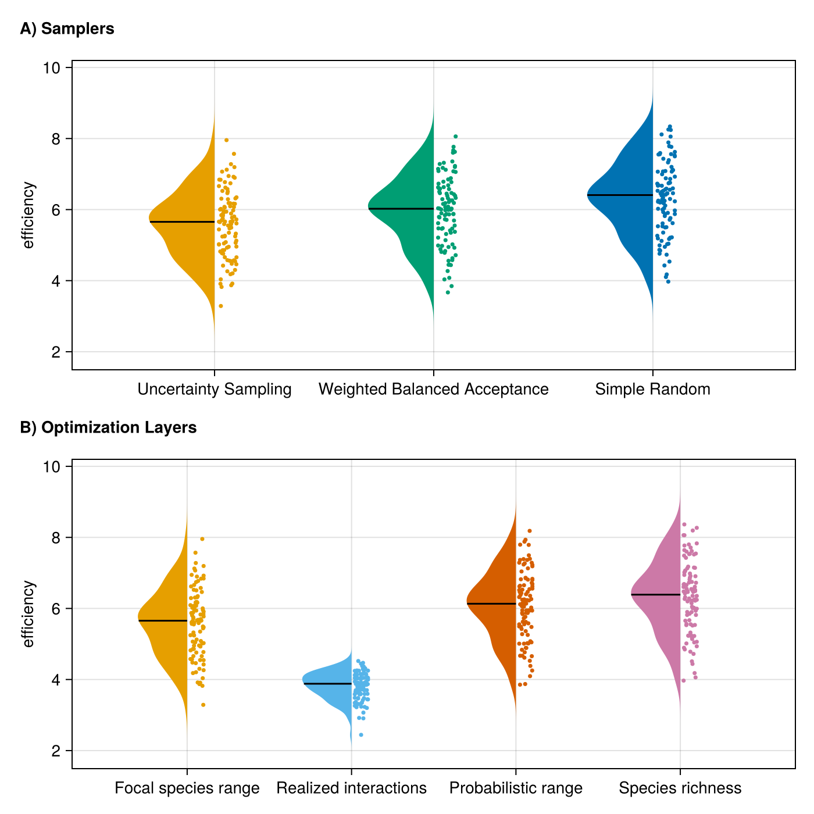
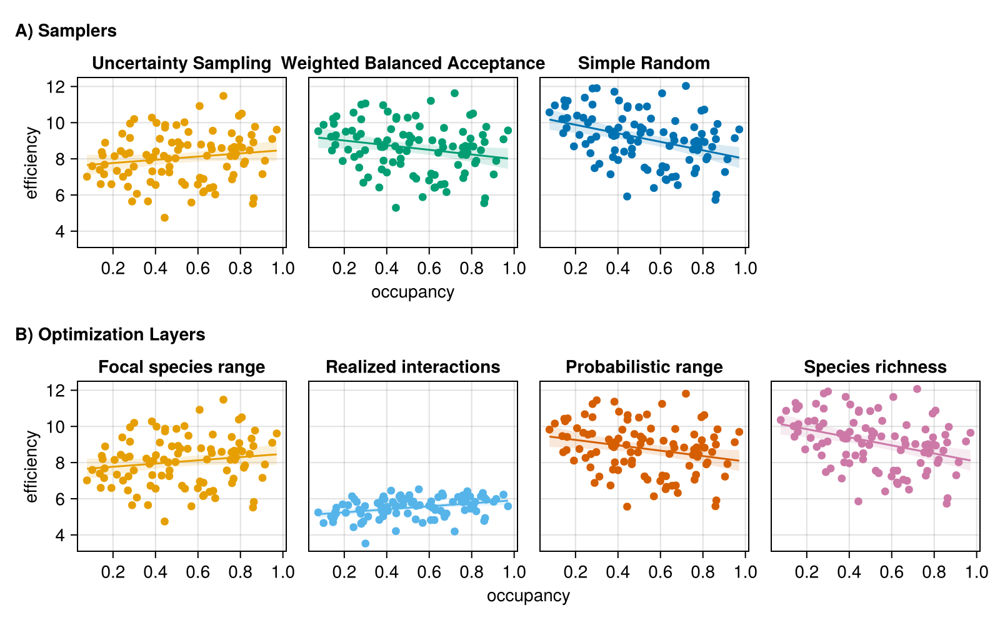
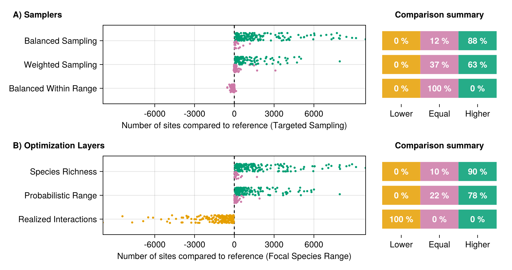

# Introduction

Here, we used simulations to test the efficiency of monitoring species
interactions and species richness within BONs, testing several methods for
design and optimization.

-   Context
    -   Biodiversity monitoring should encompass all facets of biodiversity
    -   Species interactions are rarely considered in comparison to species
        richness metrics, in part due to their inherent sampling difficulty
    -   Yet, interactions represent an biodiversity component which should be
        considered when implementing monitoring networks
    -   As interactions are inherently challenging to sample, developing methods
        for optimizing strategies is even more relevant.
-   Key questions
    -   How should we implement monitoring programs *across space* to
        efficiently capture network composition and changes as essential
        components of biodiversity?
    -   Can we monitor species interactions as efficiently as species ranges?
        What would be realistic expectations for monitoring species
        interactions?

# Methods

We explored network sampling using simulations to generate networks, species
ranges, and biodiversity observations networks (BONs). We used
`SpeciesInteractionSamplers.jl` to generate networks, species ranges, and
interaction realization and detection, following the approach introduced by
@Catchen2023MisLin.

## Evaluating metaweb sampling

Our first idea was to investigate the efficiency of sampling networks across
space to document a metaweb of interactions. Additionally, we aimed to compare
this efficiency with the efficiency at which we can document species richness.

Our first step was to simulate networks with variation across space. To do so,
we generated autocorrelated ranges (100 x 100 pixels) representing the
distribution of 75 species (an arbitrary number) and generated a metaweb using
the niche model with a connectance of 0.2 to define the feasible interactions
between the species. Combining the species ranges and the metaweb information,
we obtained the list of **possible interactions** in our landscape and for every
pixel in the landscape, based only on the co-occurrence of species with feasible
interactions. Next, we incorporated a consideration for species abundances,
which influence both interaction realization and detection. For example, rare
and low-abundance species are less likely to interact in a location because they
are less likely to encounter one another, especially compared to abundant
species, potentially leading to neutrally forbidden links [@Catchen2023MisLin;
@Canard2012EmeStr]. We set an abundance profile for our set of species following
a Normalized Log Normal distribution, then drew **realized interactions** at
each location given the abundance of species. Finally, we defined the set of
**detected interactions** by conditioning the detection of realized interactions
on the abundance distribution (even if an interaction is realized in a location,
we need to be there at that moment to detect, which is again less likely for low
probability events; @Catchen2023MisLin).

Next, we generated spatially balanced Biodiversity Observation Networks (BONs)
across our landscape, defining sites where to sample species and interactions.
We tested all number of sites between 1 and 100 and used the
`BalancedAcceptance` method to ensure spatial balance, aiming to distribute
sampling evenly across space (for a given number of sampling sites). We then
evaluated the sampling efficiency of each BON in terms of overall species
richness and compared to the generated metaweb for a each interaction type. For
species richness, we assumed we sampled all species present in a sampled
location, combined this information across all sampled sites to determine the
number of species encountered through sampling, and compared the result with the
total species richness in the landscape (75 species). For interactions, we
aggregated each interaction type separately (possible, realized and detected)
for a given BON and evaluated the proportion of the metaweb recovered through
sampling (and therefore for a given number of site). Since some interactions
might never be observed in the simulated landscapes (e.g. interacting species
who never co-occur), we also measured the proportion of sampled interactions
compared to the number of interactions actually present in the landscape
(instead of the metaweb) for each interaction type.

We ran simulations with 100 fully-independent replicates (different metaweb,
species ranges, abundance distribution, realized interactions) for each number
of site in a BON and for the two interaction references, yielding 20,000
simulations in total. Prior exploratory simulations showed the number of sites
in the BON to be the main element affecting the proportion of sampled species or
interactions compared to other model parameters such as metaweb connectance and
landscape autocorrelation.

## Focal sampling on single-species & optimization

In complement to the metaweb sampling approach, we also investigated the
sampling efficiency on a single-species basis. We simulated a focal sampling
where an observer would target one species and aim to retrieve all of its
interactions (here known from the metaweb), but might have different information
to optimize its sampling. Observation network design and efficiency needs to be
evaluated beyond spatial balance, and also regarding their efficiency at meeting
biodiversity monitoring objectives [@Norman2025AlgSel]. Thus, the idea of our
focal sampling exploration is to represent a simplified case with a clear
objective (retrieving a species' interactions) and where we do have prior
knowledge about the system, either through empirical data or model predictions,
which can be used to optimize sampling.

Optimizing focal sampling relies on two elements: the sampler algorithm used and
the information provided for optimization. Species range represents an
attainable level of information an interested observer could have, for instance
based on expert knowledge or species distribution models. Therefore, we assumed
the observer knew the species range across the landscape (presence or absence).
We tested three sampling algorithms for comparison: simple random sampling (to
represent uninformed sampling), weighted balanced acceptance sampling (aiming to
balance sites across space while weighting favorably for species ranges) and
uncertainty sampling (which targets locations with a higher value in the layer
provided). Next, we tested three information layers for optimization: one with
the focal species range (our attainable information knowledge for the observer),
one with the location of realized interactions for the focal species (to
represent a best-case scenario) and one with species richness across the
landscape (to represent a holistic level of information for the system).

Using the approach described in the previous section, we generated a single\*
set of metaweb, species ranges, and locations for realized interactions
(\*counter-verified with 10 separate sets, which yielded conceptually similar
results). We selected the species with the highest degree (number of
interactions) in the metaweb as the focal species for the simulation. We then
generated BONs of 1 to 500 sites (at interval increments of 5 sites) using the
three possible algorithms and optimization layers, with 100 replicates for every
number of sites. For each BON generated, we extracted the number of unique
realized interactions sampled across all sites (essentially the monitored degree
for the focal species)

## Efficiency

Next, we aimed to verify whether our results were constant when replicating
simulations with different simulated metawebs and species ranges. We ran 100
independent simulations, each with 50 replicates for every number of sites (once
again from 1 to 500 sites at interval increments of 5 sites). However, doing so
raised the issue of how to describe and compare the efficiency of the simulated
monitoring across samplers, optimization layers or focal species degree, given
how the generated metawebs and landscapes might vary between independent
simulations, and especially how to describe the relationship between the number
of monitoring sites and the proportion of monitored interactions.

Since the exact proportion of monitored interactions is known in our
simulations, we used the following single-parameter equation which generates
similar efficiency curves:

$$
p=\frac{x}{a + x}
$$ {#eq-eff}

where $p$ is the proportion of monitored interactions, $x$ is the number of
sites in the BON and $a$ is the efficiency parameter we use for comparison.
Here, $a$ is the single parameter describing the shape of the curve, and can be
compared across samplers, optimization layers or focal species degree. The lower
this parameter, the faster we reach a high proportion of monitored interactions.

For each independent simulation, sampler and optimization layer option, we
performed a grid search across possible values of $a$ to identify the curve
yielding the best fit with the simulation's result. Upon exploratory analysis,
we observed that searching for values of $a$ on an exponential scale allowed for
more gradual control over the curve shape, and therefore we searched we searched
directly for values of $e^a$ (effectively replacing $a$ by $e^a$ in @eq-eff). We
performed a grid search of 10,000 evenly spaced values between -5 and 15 (limits
chosen to go beyond the fitted values), and selected the value of $a$ yielding
the curve minimizing the sum of squared errors to the values from the
simulation.

# Results

Our results for metaweb sampling highlight a marked difference between the
proportions of sampled species and interactions (Figure 1). Sampled species
saturated very quickly, with all species sampled with less than 25 sites in a
BON across the landscape. Possible interactions, which depend on co-occurrence
of species with a feasible interaction in the metaweb, also saturated quickly,
reaching over 90% of interactions in the metaweb with 25 sites and increasing
asymptotically afterwards. In contrast, realized and detected interactions,
which account for the impact of species abundances, reach much lower
proportions, both under 25% of the metaweb after 100 sites. While the proportion
would keep increasing with a higher number of sites, the speed at which
interactions accumulate is notably lower than for species richness and possible
interactions, highlighting the need for a much higher expected sampling effort.

![Proportion of sampled species and interactions for a given number of sampling
sites in a Biodiversity Observation Network (BON) across the simulated
landscape. The central line indicates indicates the median proportion for a
given number of sites while the shaded bands delimit the 5th and 95th percentile
across replicates. The global reference (left) uses total species richness and
the total number of interactions in the metaweb as the maximum reference to
calculate the proportion while the per-element reference (right) uses the
maximum number of an interaction actually present in the simulated
landscape.](figures/nbon_bands.png)

Our focal sampling experiment showed the Uncertainty Sampling algorithm to be
most efficient at optimizing BON-design based on a known species range and while
aiming to maximize the sampling of interactions of a single focal species
(Figure 2). Simple Random sampling, as a proxy for uninformed sampling,
performed the worst among the algorithms tested. Weighted Balanced Acceptance
performed notably less than Uncertainty Sampling at maximizing the efficiency
for the focal species, although it maintained a better spatial balance across
the landscape.

Optimizing on the known species range, our proxy for an attainable level of
information an interested user might have, was a more efficient strategy to
retrieve the focal species' interactions than optimization based on species
richness (or interaction richness), effectively sampling more than half of the
species' interactions. In contrast, optimization based on the location of
realized interactions, our best-case scenario requiring a higher level
information, expectedly performed better, retrieving most of the species'
interactions.

Also explored but not tested with all sampler/optimization layer possibilities
(potential supp. mat?):

-   4 species with different degree: proportion of interactions monitored was
    sometimes higher for a species with intermediate degree than for the species
    with highest degree (which makes sense given rare interactions). Otherwise,
    both the proportion and absolute number tended to be low for species with
    low or very low degree.
-   Optimization for possible & detected interactions: not an interesting
    result. Possible interactions saturate way too fast, while detected
    interactions are always lower than realized interactions and don't make
    sense as a pre-detection optimization target
-   Optimisation with interaction richness: same as species richness, less
    efficient than species range
-   Optimisation with richness of possible interactions for the focal species:
    same as species range, since they're essentially the same

# Discussion

What should be realistic expectations for sampling and monitoring of species
interactions?

-   Not as high as species richness and not as simple as co-occurrence of
    interacting species
-   Expectations should be much lower given abundances, and our simulations
    highlight a way this could happen
-   This means we can apply motoring to species interactions, with limits.

We can improve coverage with the right optimization method. But to do so, we
need a clear and attainable sampling or monitoring objective.

-   Again, we come back to a single species perspective as most attainable and
    understandable level of information while yielding relevant results.
-   Optimizing on species range is an efficient strategy to retrieve its
    interactions (most attainable information), better than optimization based
    on species or interaction richness and surpassed only by knowledge of it's
    realized interactions

Our results offer insights into defining realistic expectations for interaction
monitoring. With the right target and optimization strategy, available
information, such as species ranges, can guide observation network designs to
monitor species interactions with a reasonable number of sites.

# References

::: {#refs}
:::